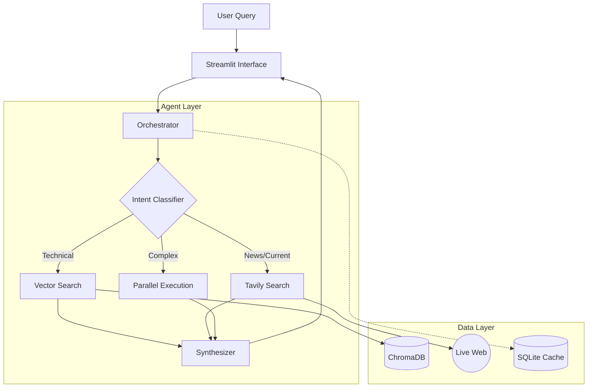

# Nexus Research Assistant


> **An autonomous, multi-agent RAG system geared for high-precision hybrid research.**

**Nexus** bridges the gap between static knowledge bases and the dynamic web. By orchestrating specialized agents for classification, research, and synthesis, it delivers comprehensive, citated intelligence that evolves with the world.

---

## 🚀 Key Features

- **Hybrid Retrieval Engine**: Intelligently routes queries to **ChromaDB** (local vector store), **Tavily** (web search), or both based on intent.
- **Agentic Workflow**:
    - **Classifier**: Detects temporal context, complexity, and specific entity extraction.
    - **Researcher**: Executes parallel search strategies with intelligent fallback logic.
    - **Synthesizer**: Fuses multi-modal context into a single, cohesive narrative.
- **Precision Caching**: Custom SQLite-backed caching layer reduces API latency and operational costs.
- **Dual-Source Citations**: Rigorous attribution system distinguishing between authoritative internal documents and real-time external data.
- **Adaptive UI**: Streamlit-based interface with dynamic source toggling (Auto, KB Only, Web Only, Hybrid).

## 🏗 System Architecture

Nexus employs a modular, event-driven architecture designed for scalability and fault tolerance.



## 🛠 Tech Stack

- **Orchestration**: LangChain
- **Interface**: Streamlit
- **Vector Store**: ChromaDB (MiniLM-L6-v2 / OpenAI Ada-002)
- **Search Engine**: Tavily AI Search API
- **LLM**: GPT-4o-mini
- **Testing**: Pytest (Unit & Integration)

## 📦 Installation & Deployment

### Local Development

1. **Clone & Setup**
   ```bash
   git clone https://github.com/Arv-ind-s/Nexus-Research-Assistant.git
   cd Nexus-Research-Assistant
   python -m venv venv
   source venv/bin/activate
   pip install -r requirements.txt
   ```

2. **Environment Configuration**
   Create a `.env` file based on `.env.example`:
   ```bash
   OPENAI_API_KEY=sk-...
   TAVILY_API_KEY=tvly-...
   ```

3. **Ingest Knowledge Base**
   ```bash
   # Processes PDFs in data/sample_docs and indexes them into ChromaDB
   python scripts/init_knowledge_base.py
   ```

4. **Launch Application**
   ```bash
   streamlit run app.py
   ```

### ☁️ Cloud Deployment

This application is ready for deployment on **Streamlit Cloud**.
See **[DEPLOYMENT.md](DEPLOYMENT.md)** for detailed, step-by-step instructions.

## 🤝 Contribution

Contributions are welcome! Please fork the repository and submit a pull request.

## 📄 License

Distributed under the **MIT License**. See `LICENSE` for more information.

---

**Developed by Aravind S**  
[LinkedIn](https://www.linkedin.com/in/97aravind-s/) | [GitHub](https://github.com/Arv-ind-s)
